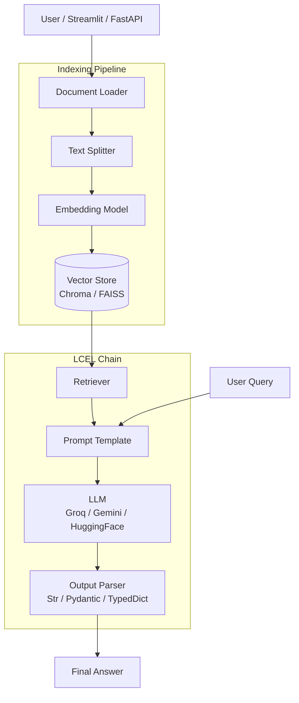

# LangChain Training Project — Full Documentation

<!-- > **Project path:** `C:\Users\aryan\OneDrive\Desktop\LLM Training\LangChain` -->
> **Languages / Stack:** Python 3, LangChain, Groq (LLaMA-3.3-70b), Google Gemini, HuggingFace, ChromaDB, FAISS, Streamlit, FastAPI

---

## Table of Contents

1. [Project Overview](#1-project-overview)
2. [Folder Structure](#2-folder-structure)
3. [Dependency Map](#3-dependency-map)
4. [Module Deep-Dives](#4-module-deep-dives)
   - 4.1 [Models](#41-models)
   - 4.2 [PROMPT](#42-prompt)
   - 4.3 [Output_Parsers](#43-output_parsers)
   - 4.4 [Structured_Outputs](#44-structured_outputs)
   - 4.5 [Chain](#45-chain)
   - 4.6 [Runnable](#46-runnable)
   - 4.7 [DocumentLoader](#47-documentloader)
   - 4.8 [Text_Splitter](#48-text_splitter)
   - 4.9 [Vector_Store](#49-vector_store)
   - 4.10 [Retriever](#410-retriever)
   - 4.11 [ChatBot](#411-chatbot)
   - 4.12 [Multimodal\_Multipdf\_RAG](#412-multimodal_multipdf_rag)
   - 4.13 [Youtube\_Chat\_RAG](#413-youtube_chat_rag)
5. [Architecture Diagram](#5-architecture-diagram)
6. [End-to-End RAG Data Flow](#6-end-to-end-rag-data-flow)
7. [Key Patterns & Best Practices Observed](#7-key-patterns--best-practices-observed)

---

## 1. Project Overview

This repository is a structured, module-by-module LangChain learning project. Each folder isolates one LangChain concept or building block, progressing from individual primitives (models, prompts, parsers) to complete RAG (Retrieval-Augmented Generation) applications. The two capstone projects are:

- **Multimodal Multi-PDF RAG** — uses CLIP for image embeddings + FAISS for vector search + a Gemini LLM.
- **YouTube Chat RAG** — fetches YouTube transcripts in real time, indexes them in FAISS, and exposes a Streamlit UI and a FastAPI backend.

The primary LLM throughout most exercises is `llama-3.3-70b-versatile` accessed via **Groq** for ultra-fast inference.

---

## 2. Folder Structure

```
LangChain/
├── .env                          # API keys (GROQ_API_KEY, GOOGLE_API_KEY, HF_TOKEN)
├── requirements.txt              # Root-level Python dependencies
│
├── Models/
│   ├── Chat_Models/
│   │   ├── model.py              # ChatGroq demo
│   │   ├── gemini.py             # ChatGoogleGenerativeAI demo
│   │   └── hf.py                 # HuggingFaceEndpoint + ChatHuggingFace demo
│   ├── Embedding_Models/
│   │   └── similarity.py         # GoogleGenerativeAIEmbeddings + cosine similarity
│   └── LLM/
│       └── llm_demo.py           # Minimal LLM .invoke() demo
│
├── PROMPT/
│   ├── message.py                # Raw message objects
│   ├── chat_prompt_template.py   # ChatPromptTemplate
│   ├── message_placeholder.py    # MessagesPlaceholder for conversation history
│   ├── prompt_generator.py       # PromptTemplate.save() to JSON
│   ├── prompt_ui.py              # Streamlit UI + load_prompt()
│   └── template.json             # Saved prompt template
│
├── Output_Parsers/
│   ├── stroutput.py              # Manual two-step invoke with StrOutputParser
│   ├── stroutput2.py             # Chained StrOutputParser via LCEL pipe operator
│   └── structuredOutputParser.py # PydanticOutputParser with schema
│
├── Structured_Outputs/
│   ├── Pydantic.py               # Pydantic BaseModel validation demo
│   └── typedict.py               # TypedDict + model.with_structured_output()
│
├── Chain/
│   ├── chain.py                  # Simple LCEL chain + get_graph()
│   ├── seqchain.py               # Sequential two-step chain
│   ├── parallelchain.py          # RunnableParallel two-branch merge
│   └── conditionalchain.py       # Sentiment routing via RunnableBranch
│
├── Runnable/
│   ├── runnable_seq.py           # RunnableSequence (explicit constructor)
│   ├── runnable_parallel.py      # RunnableParallel for multi-output generation
│   ├── runnable_passthrough.py   # RunnablePassthrough to forward raw input
│   ├── runnable_lambda.py        # RunnableLambda for custom Python functions
│   └── runnable_branch.py        # RunnableBranch conditional routing
│
├── DocumentLoader/
│   ├── text_loader.py            # TextLoader
│   ├── pypdf1.py                 # PyPDFLoader
│   ├── webbased_loader.py        # WebBaseLoader
│   ├── directory_loader.py       # DirectoryLoader (batch PDF)
│   ├── ai.txt                    # Sample text document
│   └── books/                    # Sample PDF library
│
├── Text_Splitter/
│   ├── text_structure.py         # RecursiveCharacterTextSplitter (general text)
│   ├── document_based.py         # RecursiveCharacterTextSplitter.from_language()
│   └── semantic_meaning.py       # SemanticChunker (embedding-based)
│
├── Vector_Store/
│   └── chroma.py                 # Chroma.from_documents() + CRUD operations
│
├── Retriever/
│   ├── vector_store.py           # Chroma retriever with as_retriever()
│   └── wikipedia_retriever.py    # WikipediaRetriever
│
├── ChatBot/
│   └── chatbot.py                # Multi-turn chat loop with message history
│
├── Multimodal_Multipdf_RAG/
│   └── app.py                    # CLIP + FAISS multimodal RAG
│
└── Youtube_Chat_RAG/
    ├── app.py                    # Streamlit frontend RAG
    └── backend/
        └── app.py                # FastAPI backend RAG
```

---

## 3. Dependency Map

| Module | Key Packages |
|--------|-------------|
| All modules | `langchain-core`, `langchain`, `python-dotenv` |
| Chat Models / LLM | `langchain-groq`, `langchain-google-genai`, `langchain-huggingface` |
| Embeddings | `langchain-google-genai` → `GoogleGenerativeAIEmbeddings`, `langchain-community` → `HuggingFaceEmbeddings` |
| Parsers | `pydantic` (v2) |
| Document Loaders | `langchain-community` → `TextLoader`, `PyPDFLoader`, `WebBaseLoader`, `DirectoryLoader` |
| Text Splitters | `langchain-text-splitters`, `langchain-experimental` |
| Vector Stores | `langchain-chroma`, `langchain-community` → `FAISS` |
| Retrievers | `langchain-community` → `WikipediaRetriever` |
| Multimodal RAG | `transformers` (CLIP), `Pillow`, `torch`, `pymupdf (fitz)`, `scikit-learn` |
| YouTube RAG | `youtube-transcript-api`, `streamlit`, `fastapi`, `uvicorn` |

---

## 4. Module Deep-Dives

---

### 4.1 Models

#### `Models/LLM/llm_demo.py`

**Purpose:** Minimal LLM invocation using Groq.

| Function / Object | Source | Parameters | Returns | Notes |
|---|---|---|---|---|
| `load_dotenv()` | `python-dotenv` | — | `bool` | Loads `.env` into `os.environ` |
| `ChatGroq(model=...)` | `langchain_groq` | `model: str` | `ChatGroq` instance | Connects to Groq inference API |
| `model.invoke(prompt)` | LangChain Runnable | `input: str \| list[BaseMessage]` | `AIMessage` | Sends a single request to the LLM |

```python
model = ChatGroq(model='llama-3.3-70b-versatile')
result = model.invoke("What is the capital of India")
print(result.content)   # → "New Delhi"
```

---

#### `Models/Chat_Models/model.py`

**Purpose:** Demonstrates `ChatGroq` constructor parameters for fine-tuning.

| Parameter | Type | Effect |
|---|---|---|
| `model` | `str` | Model name on Groq's platform |
| `temperature` | `float` | Randomness (0 = deterministic, 2 = very random) |
| `max_tokens` | `int` | Hard cap on response length |

```python
model = ChatGroq(model='llama-3.3-70b-versatile', temperature=1, max_tokens=100)
```

---

#### `Models/Chat_Models/gemini.py`

**Purpose:** Uses Google's Gemini model through LangChain.

| Function / Object | Source | Parameters | Returns |
|---|---|---|---|
| `ChatGoogleGenerativeAI(model=...)` | `langchain_google_genai` | `model: str` e.g. `'gemini-2.5-flash'` | Chat-compatible LangChain model |
| `model.invoke(text)` | LangChain | `str` | `AIMessage` |

```python
model = ChatGoogleGenerativeAI(model='gemini-2.5-flash')
result = model.invoke("What is the capital of India")
print(result.content)
```

---

#### `Models/Chat_Models/hf.py`

**Purpose:** Uses a HuggingFace hosted model (Llama-3.1-8B) via the serverless Inference API.

| Function / Object | Source | Parameters | Returns |
|---|---|---|---|
| `HuggingFaceEndpoint(repo_id, task)` | `langchain_huggingface` | `repo_id: str`, `task: str` (must be `"text-generation"`) | Raw LLM endpoint |
| `ChatHuggingFace(llm=endpoint)` | `langchain_huggingface` | `llm: HuggingFaceEndpoint` | Chat-compatible wrapper |
| `model.invoke(messages)` | LangChain | `list[tuple[str,str]]` or `list[BaseMessage]` | `AIMessage` |

> [!IMPORTANT]
> The `task` must be `"text-generation"`, not `"conversational"` — the latter causes runtime errors with newer models.

```python
llm = HuggingFaceEndpoint(repo_id="meta-llama/Llama-3.1-8B-Instruct", task="text-generation")
model = ChatHuggingFace(llm=llm)
result = model.invoke([("system", "You are funny."), ("human", "Tell me a joke")])
```

---

#### `Models/Embedding_Models/similarity.py`

**Purpose:** Embeds documents and queries, computes cosine similarity to find the most relevant document.

| Function | Source | Parameters | Returns |
|---|---|---|---|
| `GoogleGenerativeAIEmbeddings(model, output_dimensionality)` | `langchain_google_genai` | `model: str`, `output_dimensionality: int` | Embeddings object |
| `embedding.embed_documents(docs)` | Embeddings | `docs: list[str]` | `list[list[float]]` — one vector per document |
| `embedding.embed_query(query)` | Embeddings | `query: str` | `list[float]` — single query vector |
| `cosine_similarity(A, B)` | `sklearn.metrics.pairwise` | Two 2D arrays | Similarity score matrix `[0, 1]` |
| `sorted(enumerate(scores), key=lambda x: x[1])[-1]` | Python built-in | — | `(index, score)` of best match |

**Data flow:**
```
documents (list[str])
    ↓ embed_documents()
doc_embeddings (list[list[float]])
    ↓
query → embed_query() → query_embedding (list[float])
    ↓ cosine_similarity([query_embedding], doc_embeddings)
score matrix → sort → best (index, score)
    ↓
print(documents[index], score)
```

---

### 4.2 PROMPT

#### `PROMPT/message.py`

**Purpose:** Showcases the three core LangChain message types used in chat-based LLMs.

| Class | Role |
|---|---|
| `SystemMessage(content)` | Provides model persona / instructions |
| `HumanMessage(content)` | Represents a user turn |
| `AIMessage(content)` | Represents a model response (appended to history) |

```python
messages = [
    SystemMessage(content="You are a helpful assistant"),
    HumanMessage(content="Tell me about LangChain")
]
result = model.invoke(messages)
messages.append(AIMessage(content=result.content))
```

---

#### `PROMPT/chat_prompt_template.py`

**Purpose:** Demonstrates `ChatPromptTemplate` — a reusable, parameterisable multi-turn template.

| Function | Parameters | Returns |
|---|---|---|
| `ChatPromptTemplate([...])` | `list[tuple[role, template_str]]` | Template object |
| `chat_template.invoke({'domain': ..., 'topic': ...})` | `dict` of variable values | `ChatPromptValue` (list of messages ready to send) |

```python
chat_template = ChatPromptTemplate([
    ('system', 'You are a helpful {domain} expert'),
    ('human', 'Explain in simple terms, what is {topic}')
])
prompt = chat_template.invoke({'domain': 'cricket', 'topic': 'Dusra'})
```

---

#### `PROMPT/message_placeholder.py`

**Purpose:** Shows how to inject a dynamic conversation history into a prompt.

| Class/Function | Parameters | Returns |
|---|---|---|
| `MessagesPlaceholder(variable_name)` | `variable_name: str` | Placeholder slot in a `ChatPromptTemplate` |
| `chat_template.invoke({'chat_history': [...], 'query': ...})` | dict | `ChatPromptValue` |

**Use case:** Customer support bot that remembers prior messages.

```python
chat_template = ChatPromptTemplate([
    ('system', 'You are a helpful customer support agent'),
    MessagesPlaceholder(variable_name='chat_history'),
    ('human', '{query}')
])
```

---

#### `PROMPT/prompt_generator.py`

**Purpose:** Creates a complex, multi-variable `PromptTemplate` and serializes it to disk.

| Function | Parameters | Returns |
|---|---|---|
| `PromptTemplate(template, input_variables, validate_template)` | `template: str`, `input_variables: list[str]`, `validate_template: bool` | `PromptTemplate` |
| `template.save('template.json')` | `path: str` | Writes JSON to disk |

```python
template = PromptTemplate(
    template="Please summarize `{paper_input}` in style `{style_input}` at length `{length_input}`...",
    input_variables=['paper_input', 'style_input', 'length_input'],
    validate_template=True
)
template.save('template.json')   # → creates template.json
```

---

#### `PROMPT/prompt_ui.py`

**Purpose:** Streamlit UI that loads the saved template from JSON and runs it.

| Function | Source | Return |
|---|---|---|
| `load_prompt('template.json')` | `langchain_core.prompts` | `PromptTemplate` (deserialized) |
| `st.selectbox(label, options)` | `streamlit` | Selected string value |
| `st.button(label)` | `streamlit` | `bool` — `True` when clicked |
| `chain.invoke({...})` | LangChain | `AIMessage` |

```
[Streamlit UI] → selectbox inputs → PromptTemplate (loaded from JSON)
    ↓ chain (template | model)
model.invoke → result.content → st.write()
```

---

### 4.3 Output_Parsers

#### `Output_Parsers/stroutput.py` — Manual Two-Step Invocation

**Purpose:** Shows the verbose, manual way of chaining two prompts before `StrOutputParser` was used with the pipe operator.

| Function | Returns |
|---|---|
| `template.invoke({'topic': ...})` | `PromptValue` ready to pass to a model |
| `model.invoke(prompt_value)` | `AIMessage` |
| `result.content` | `str` — the raw model output |

**Data Flow:**
```
template1.invoke({topic}) → prompt1 (PromptValue)
    ↓ model.invoke(prompt1)
result1 (AIMessage) →result1.content
    ↓ template2.invoke({text: result1.content})
prompt2 → model.invoke(prompt2)
    ↓
result2 (AIMessage) → print
```

---

#### `Output_Parsers/stroutput2.py` — LCEL Pipe Operator

**Purpose:** Refactors `stroutput.py` using LCEL (LangChain Expression Language) pipe syntax into a single composable chain.

| Function | Returns |
|---|---|
| `StrOutputParser()` | Parser that extracts `.content` as a plain `str` |
| `chain = template1 \| model \| parser \| template2 \| model \| parser` | `RunnableSequence` |
| `chain.invoke({'topic': ...})` | Final `str` output |

> [!NOTE]
> The `StrOutputParser` is critical here: without it, the second `PromptTemplate` would receive an `AIMessage` instead of a `str`, causing a type mismatch in the template's `{text}` variable.

---

#### `Output_Parsers/structuredOutputParser.py` — Pydantic Schema Enforcement

**Purpose:** Forces the LLM to respond in a strict JSON structure matched to a Pydantic model.

| Function / Class | Source | Role |
|---|---|---|
| `class Student(BaseModel)` | `pydantic` | Schema definition |
| `Field(gt=18, description=...)` | `pydantic` | Adds validation constraints (gt=greater than) and a format hint |
| `PydanticOutputParser(pydantic_object=Student)` | `langchain_core` | Wraps the schema to generate JSON format instructions |
| `parser.get_format_instructions()` | `PydanticOutputParser` | Returns a string inserted into the prompt instructing the LLM on its expected JSON format |
| `partial_variables={'format_instruction': ...}` | `PromptTemplate` | Pre-fills a template variable at template-creation time |
| `template.invoke({'place': ...})` | `PromptTemplate` | Returns a `PromptValue` with the format instructions already embedded |

```python
class Student(BaseModel):
    name: str = Field(description="Name of the student")
    age: int = Field(gt=18, description="Age of the student")
    city: str = Field(description="City of the student")

parser = PydanticOutputParser(pydantic_object=Student)
template = PromptTemplate(
    template='Give details of a fictional {place} person\n{format_instruction}',
    input_variables=['place'],
    partial_variables={'format_instruction': parser.get_format_instructions()}
)
```

---

### 4.4 Structured_Outputs

#### `Structured_Outputs/Pydantic.py`

**Purpose:** Pure Pydantic v2 demo — validates data, serializes to dict and JSON.

| Function | Source | Returns |
|---|---|---|
| `Review(**data_dict)` | `pydantic.BaseModel` | Validated `Review` instance (raises `ValidationError` if invalid) |
| `dict(student)` | Python built-in | Plain Python `dict` |
| `student.model_dump_json()` | Pydantic v2 | JSON `str` |
| `Field(gt=0, lt=10, default=5)` | `pydantic` | Field with numeric range validation and a default |
| `Optional[int]` | `typing` | Field may be `None` |
| `EmailStr` | `pydantic` | Validates email format |

---

#### `Structured_Outputs/typedict.py`

**Purpose:** Uses Python's `TypedDict` with `Annotated` descriptions to produce structured, typed LLM output — without needing a separate parser.

| Function | Source | Returns |
|---|---|---|
| `class Review(TypedDict)` | `typing` | Schema describing the expected key-value output |
| `Annotated[list[str], "description"]` | `typing` | Annotates the key with a natural-language description the LLM reads |
| `model.with_structured_output(Review)` | LangChain ChatModel | Returns a new model variant that enforces the schema |
| `structured_model.invoke(text)` | LangChain | Python `dict` matching `Review` keys |

```python
class Review(TypedDict):
    key_theme: Annotated[list[str], "List key themes discussed"]
    pros: Annotated[Optional[list[str]], "List pros per theme"]
    cons: Annotated[Optional[list[str]], "List cons per theme"]
    summary: Annotated[str, "Brief summary"]
    sentiment: Annotated[str, "positive, negative, or neutral"]

structured_model = model.with_structured_output(Review)
result = structured_model.invoke("...product review text...")
print(result['sentiment'])   # → "positive"
```

---

### 4.5 Chain

#### `Chain/chain.py` — Basic LCEL Chain

**Purpose:** The simplest complete pipeline: prompt → LLM → parser.

| Component | Type | Role |
|---|---|---|
| `PromptTemplate(template, input_variables)` | LangChain | Parameterisable text template |
| `ChatGroq(model=...)` | LangChain | LLM inference via Groq |
| `StrOutputParser()` | LangChain | Strips `AIMessage` → plain `str` |
| `chain = prompt \| model \| parser` | `RunnableSequence` | LCEL pipe composition |
| `chain.invoke({'topic': 'Cricket'})` | `RunnableSequence` | Runs the full pipeline |
| `chain.get_graph().print_ascii()` | LangChain debug | Prints ASCII DAG of the chain |

---

#### `Chain/seqchain.py` — Sequential Two-Step Chain

**Purpose:** Chains two prompts sequentially — first generates a detailed report, then summarises it.

```
{topic} → prompt1 → model → (report text)
    ↓ automatically piped as {text} input
prompt2 → model → parser → (5-line summary)
```

> [!NOTE]
> The intermediate string from `parser` is automatically routed to `prompt2`'s `{text}` variable because `StrOutputParser` returns a raw `str`, which `prompt2.invoke()` accepts directly.

---

#### `Chain/parallelchain.py` — Parallel Chain with Merge

**Purpose:** Generates study notes and a quiz simultaneously, then merges them.

| Object | Parameters | Role |
|---|---|---|
| `RunnableParallel({'notes': ..., 'quiz': ...})` | `dict[str, Runnable]` | Executes both chains in parallel, returns `{'notes': str, 'quiz': str}` |
| `prompt3` | `template="{notes} and {quiz}"` | Merge prompt that consumes both parallel outputs |
| `chain = parallel_chain \| merge_chain` | — | Output dict of parallel feeds directly into `merge_chain` inputs |

```
                ┌─ prompt1 → model → parser → notes ─┐
{topic} ───────|                                      |─→ prompt3 → model → parser → final
                └─ prompt2 → model → parser → quiz  ─┘
```

---

#### `Chain/conditionalchain.py` — Sentiment Routing

**Purpose:** Classifies feedback sentiment and routes to a different prompt depending on the result.

| Object | Parameters | Role |
|---|---|---|
| `class Classify(BaseModel)` | `sentiment: Literal['Positive','Negative']` | Schema restricts output to two values |
| `PydanticOutputParser(pydantic_object=Classify)` | — | Parses sentiment classification output |
| `chain1 = prompt1 \| model \| parser2` | — | Sentiment classification chain → returns `Classify` object |
| `RunnableBranch((condition, runnable), ..., default)` | `list[tuple[Callable, Runnable]], Runnable` | Routes input to first matching branch |
| `lambda x: x.sentiment == 'Positive'` | Python lambda | Condition that receives the `Classify` object |
| `RunnableLambda(lambda x: "Could not find sentiment")` | — | Default fallback if no condition matches |
| `chain = chain1 \| branch_chain` | — | Composed end-to-end conditional chain |

```
feedback → prompt1 → model → PydanticParser → Classify(sentiment=...)
    ↓
RunnableBranch:
    if sentiment=='Positive' → prompt2 → model → parser → gratitude response
    if sentiment=='Negative' → prompt3 → model → parser → apology response
    else                     → "Could not find sentiment"
```

---

### 4.6 Runnable

All files in this module explore LangChain's **Runnable** primitives explicitly (without just using the `|` pipe shorthand).

#### `Runnable/runnable_seq.py` — `RunnableSequence`

| Function | Parameters | Returns |
|---|---|---|
| `RunnableSequence(step1, step2, ...)` | Ordered `Runnable` args | A composed sequence runnable |
| `chain.invoke({'topic': ...})` | `dict` | Final output of last step |

```python
chain = RunnableSequence(prompt, model, parser, prompt1, model, parser)
```

This is the explicit equivalent of: `prompt | model | parser | prompt1 | model | parser`.

---

#### `Runnable/runnable_parallel.py` — `RunnableParallel`

**Purpose:** Generates a tweet and a LinkedIn post for the same topic simultaneously.

```python
chain = RunnableParallel({
    'tweet': RunnableSequence(prompt, model, parser),
    'LinkedIn Post': RunnableSequence(prompt1, model, parser),
})
result = chain.invoke({'topic': 'AI'})
# result → {'tweet': '...', 'LinkedIn Post': '...'}
```

---

#### `Runnable/runnable_passthrough.py` — `RunnablePassthrough`

**Purpose:** Forwards the raw input unchanged alongside a transformed branch.

| Object | Behaviour |
|---|---|
| `RunnablePassthrough()` | Passes its input directly to output without modification |

```python
chain2 = RunnableParallel({
    'joke': RunnablePassthrough(),          # forwards the raw joke string
    'explanation': RunnableSequence(prompt1, model, parser)  # explains it
})
chain = RunnableSequence(chain1, chain2)
# result → {'joke': '...', 'explanation': '...'}
```

---

#### `Runnable/runnable_lambda.py` — `RunnableLambda`

**Purpose:** Wraps a plain Python function to make it a composable LangChain step.

```python
def word_counter(text: str) -> int:
    return len(text.split())

runnable_word_counter = RunnableLambda(word_counter)

chain2 = RunnableParallel({
    'joke': RunnablePassthrough(),
    'word_count': RunnableLambda(word_counter)
})
```

| Function | Parameters | Returns |
|---|---|---|
| `RunnableLambda(func)` | `func: Callable[[Any], Any]` | Runnable that calls `func` on its input |

---

#### `Runnable/runnable_branch.py` — `RunnableBranch`

**Purpose:** Conditionally summarises text only if it exceeds 500 words.

```python
def word_counter(text: str) -> int:
    return len(text.split())

chain2 = RunnableBranch(
    (lambda x: word_counter(x) > 500, prompt2 | model | parser),  # summarize long text
    (RunnablePassthrough())                                         # pass short text as-is
)
```

| Parameter | Type | Role |
|---|---|---|
| `(condition, runnable)` | `tuple[Callable, Runnable]` | If condition is `True`, run this branch |
| Last positional arg | `Runnable` | Default/fallback branch |

---

### 4.7 DocumentLoader

All loaders return `list[Document]` where `Document` has two key fields:
- `page_content: str` — the raw text
- `metadata: dict` — source information (file path, page number, URL, etc.)

#### `DocumentLoader/text_loader.py` — `TextLoader`

```python
loader = TextLoader('ai.txt', encoding='utf-8')
docs = loader.load()   # → list[Document]
# docs[0].page_content → full file text
```

| Function | Parameters | Returns |
|---|---|---|
| `TextLoader(path, encoding)` | `path: str`, `encoding: str` | Loader instance |
| `loader.load()` | — | `list[Document]` (single item for text files) |

---

#### `DocumentLoader/pypdf1.py` — `PyPDFLoader`

```python
loader = PyPDFLoader('Assignment.pdf')
docs = loader.load()
# One Document per PDF page — docs[0], docs[1], ...
```

| Function | Parameters | Returns |
|---|---|---|
| `PyPDFLoader(path)` | `path: str` | Loader instance |
| `loader.load()` | — | `list[Document]` — one `Document` per PDF page |

---

#### `DocumentLoader/webbased_loader.py` — `WebBaseLoader`

```python
loader = WebBaseLoader('https://www.youtube.com/watch?v=...')
docs = loader.load()
# Scrapes and extracts visible text from the URL
```

| Function | Parameters | Returns |
|---|---|---|
| `WebBaseLoader(url)` | `url: str` | Loader instance |
| `loader.load()` | — | `list[Document]` — scraped web content |

---

#### `DocumentLoader/directory_loader.py` — `DirectoryLoader`

**Purpose:** Batch-loads all PDFs in a directory.

```python
loader = DirectoryLoader(
    path='books',
    glob='*.pdf',       # only match PDF files
    loader_cls=PyPDFLoader  # which sub-loader to use per file
)
docs = loader.load()
```

| Parameter | Type | Role |
|---|---|---|
| `path` | `str` | Root directory to crawl |
| `glob` | `str` | Wildcard pattern (e.g., `"*.pdf"`, `"**/*.txt"`) |
| `loader_cls` | `Type[BaseLoader]` | Sub-loader class applied to each matched file |

> [!TIP]
> Use `loader.lazy_load()` for memory-efficient processing of very large document collections — it yields `Document` objects one at a time instead of loading everything into memory.

---

### 4.8 Text_Splitter

#### `Text_Splitter/text_structure.py` — `RecursiveCharacterTextSplitter` (General)

**Purpose:** Splits general prose/structured text into fixed-size chunks with overlap.

```python
splitter = RecursiveCharacterTextSplitter(
    chunk_size=300,    # max characters per chunk
    chunk_overlap=0    # no repeated content between chunks
)
chunks = splitter.split_text(text)  # → list[str]
```

| Method | Parameters | Returns |
|---|---|---|
| `split_text(text)` | `text: str` | `list[str]` |
| `split_documents(docs)` | `list[Document]` | `list[Document]` (metadata preserved) |
| `create_documents(texts)` | `list[str]` | `list[Document]` |

The splitter tries these separators in order: `["\n\n", "\n", " ", ""]` until chunks fit within `chunk_size`.

---

#### `Text_Splitter/document_based.py` — `from_language()` (Code-Aware)

**Purpose:** Splits code files respecting language syntax boundaries (function/class/import blocks).

```python
splitter = RecursiveCharacterTextSplitter.from_language(
    language=Language.PYTHON,  # knows Python syntax separators
    chunk_size=100,
    chunk_overlap=0
)
chunks = splitter.split_text(python_code_str)
```

Supported languages include: `PYTHON`, `JS`, `TS`, `JAVA`, `CPP`, `RUST`, `GO`, `HTML`, `MARKDOWN`, etc.

---

#### `Text_Splitter/semantic_meaning.py` — `SemanticChunker`

**Purpose:** Splits text based on **semantic shifts** rather than character count. Uses embedding similarity between consecutive sentences to decide split points.

```python
splitter = SemanticChunker(
    GoogleGenerativeAIEmbeddings(),   # embedding model
    breakpoint_threshold_type="standard_deviation",
    breakpoint_threshold_amount=1     # split when similarity drops > 1 std dev
)
chunks = splitter.create_documents([text])  # → list[Document]
```

| Parameter | Type | Role |
|---|---|---|
| `breakpoint_threshold_type` | `str` | `"percentile"`, `"standard_deviation"`, or `"interquartile"` |
| `breakpoint_threshold_amount` | `float` | Sensitivity of split detection |

> [!NOTE]
> `SemanticChunker` is in `langchain_experimental` — designed for high-quality RAG chunking where topic coherence matters more than chunk size uniformity.

---

### 4.9 Vector_Store

#### `Vector_Store/chroma.py`

**Purpose:** Demonstrates the full Chroma vector store lifecycle: create, add, search, filter.

```python
vector_store = Chroma.from_documents(
    embedding_function=GoogleGenerativeAIEmbeddings(
        model="models/gemini-embedding-001",
        output_dimensionality=300
    ),
    persist_directory='chroma_db',   # persists to disk
    collection_name='sample'
)
```

| Method | Parameters | Returns |
|---|---|---|
| `Chroma.from_documents(documents, embedding, persist_directory, collection_name)` | `docs: list[Document]`, `embedding`, `str`, `str` | `Chroma` vector store instance |
| `vector_store.add_documents(docs)` | `list[Document]` | Adds new docs to existing store |
| `vector_store.get(include=[...])` | `include: list[str]` — `'embeddings'`, `'documents'`, `'metadatas'` | Raw contents of the store |
| `vector_store.similarity_search(query, k)` | `query: str`, `k: int` | `list[Document]` — top-k nearest |
| `vector_store.similarity_search_with_score(query, k)` | Same | `list[tuple[Document, float]]` — with distance score |
| `vector_store.similarity_search_with_score(query, filter)` | `filter: dict` | Metadata-filtered search |

---

### 4.10 Retriever

#### `Retriever/vector_store.py` — Chroma Retriever

**Purpose:** Creates a LangChain-compatible retriever from Chroma by calling `as_retriever()`. This retriever is directly composable in LCEL chains.

```python
vector_store = Chroma.from_documents(
    documents=docs,
    embedding=embeddings,
    persist_directory="./chroma_db",
    collection_name="sample"
)
retriever = vector_store.as_retriever(
    search_type="similarity",   # also supports "mmr" (max marginal relevance)
    search_kwargs={"k": 2}      # return top-2 results
)
results = retriever.invoke("Who is Captain Cool?")
```

| Method | Parameters | Returns |
|---|---|---|
| `vector_store.as_retriever(search_type, search_kwargs)` | `search_type: str`, `search_kwargs: dict` | `VectorStoreRetriever` (a `Runnable`) |
| `retriever.invoke(query)` | `query: str` | `list[Document]` |

> [!IMPORTANT]
> When creating `Chroma.from_documents()`, use `embedding=` (not `embedding_function=`) as the keyword argument. The two are not interchangeable versions of the same API.

---

#### `Retriever/wikipedia_retriever.py` — `WikipediaRetriever`

**Purpose:** Retrieves live Wikipedia articles as LangChain `Document` objects.

```python
retriever = WikipediaRetriever(top_k_results=2, lang="en")
docs = retriever.invoke("geopolitical history of India and Iran")
for i, doc in enumerate(docs):
    print(f"Result {i+1}: {doc.page_content[:200]}")
```

| Parameter | Type | Role |
|---|---|---|
| `top_k_results` | `int` | Number of Wikipedia articles to fetch |
| `lang` | `str` | Wikipedia language edition (`"en"`, `"hi"`, etc.) |

---

### 4.11 ChatBot

#### `ChatBot/chatbot.py`

**Purpose:** Implements a multi-turn conversational chatbot using a manual message history list.

```python
model = ChatGroq(model="llama-3.3-70b-versatile")
chat_history = []
while True:
    user_input = input("You: ")
    if user_input == "exit":
        break
    chat_history.append(HumanMessage(content=user_input))
    result = model.invoke(chat_history)
    chat_history.append(AIMessage(content=result.content))
    print("AI: ", result.content)
```

**Memory mechanism:** `chat_history` grows with each turn (no pruning). The entire list is sent to the model on every call, giving it full conversation context.

| Message Type | When Appended |
|---|---|
| `SystemMessage` | Once at init — sets the bot's persona |
| `HumanMessage` | Every user input |
| `AIMessage` | Every model response |

---

### 4.12 Multimodal_Multipdf_RAG

#### `Multimodal_Multipdf_RAG/app.py`

**Purpose:** A multimodal (text + image) RAG pipeline that uses the **CLIP** vision-language model for embeddings, reads PDFs with `PyMuPDF`, stores embeddings in FAISS, and queries using cosine similarity.

**Key Functions:**

| Function | Parameters | Returns | Notes |
|---|---|---|---|
| `CLIPModel.from_pretrained(model_id)` | `model_id: str` | Loaded CLIP model | Shared text/image embedding space |
| `CLIPProcessor.from_pretrained(model_id)` | `model_id: str` | Feature extractor/tokenizer | Preprocesses images and text for CLIP |
| `clip_model.eval()` | — | `CLIPModel` in inference mode | Disables dropout for deterministic outputs |
| `embed_image(image_data)` | `image_data: Image \| str` | `np.ndarray (512,)` | Extracts L2-normalized CLIP image embedding |
| `embed_text(text)` | `text: str` | `np.ndarray (512,)` | Extracts L2-normalized CLIP text embedding |
| `fitz.open(pdf_path)` | `pdf_path: str` | `fitz.Document` | Opens PDF using PyMuPDF |
| `page.get_text()` | — | `str` | Extracts plain text from a PDF page |
| `splitter.split_documents([temp_doc])` | `list[Document]` | `list[Document]` | Splits page text into < 500 char chunks |
| `cosine_similarity(A, B)` | Two 2D `np.ndarray` | Score matrix | Used to rank retrieved chunks by relevance |

**Data Flow:**

```
sample_1.pdf
    ↓ fitz.open() → iterate pages
    ↓ page.get_text() → text string
    ↓ RecursiveCharacterTextSplitter (chunk_size=500, overlap=100)
    ↓ chunk.page_content → embed_text() → CLIP text embedding (512-d)
    ↓ all_embedding.append(), all_docs.append()
        ↕ (for image pages)
    ↓ embed_image() → CLIP image embedding (512-d)
    ↓ cosine_similarity(query_embedding, all_embeddings)
    ↓ Top-k documents → LLM (Gemini via init_chat_model)
```

> [!NOTE]
> `embed_image` and `embed_text` both produce unit-normalized vectors in the same 512-d CLIP embedding space, enabling cross-modal similarity search (text query can retrieve image chunks and vice versa).

---

### 4.13 Youtube_Chat_RAG

This module contains two implementations of the same RAG pipeline: a **Streamlit** frontend (`app.py`) and a **FastAPI** backend (`backend/app.py`), plus a browser extension in `extension/`.

#### Shared RAG Pipeline Function: `setup_rag_pipeline(video_id, video_language)`

Both `app.py` files implement the same 9-step pipeline:

| Step | Code | Description |
|---|---|---|
| 1. Fetch transcript | `YouTubeTranscriptApi().fetch(video_id, languages=[lang])` | Downloads YouTube auto-captions |
| 2. Normalize | `" ".join(snippet.text)` | Joins all caption snippets into one string |
| 3. Split | `RecursiveCharacterTextSplitter(chunk_size=1000, overlap=200)` | Creates 1000-char overlapping chunks |
| 4. Embed | `HuggingFaceEmbeddings(model_name="sentence-transformers/all-MiniLM-L6-v2")` | Local embeddings (~22MB model, 384-d) |
| 5. Index | `FAISS.from_documents(chunks, embeddings)` | In-memory FAISS vector index |
| 6. Retrieve | `vector_store.as_retriever(search_type='similarity', search_kwargs={'k':4})` | Returns top-4 relevant chunks |
| 7. LLM | `ChatGroq(model='llama-3.3-70b-versatile', max_tokens=200)` | Fast Groq-hosted inference |
| 8. Prompt | `PromptTemplate(template="Answer ONLY from...{context}...{question}")` | RAG-style grounded prompt |
| 9. Chain | `RunnableParallel({'context': retriever \| format_docs, 'question': RunnablePassthrough()}) \| prompt \| llm \| StrOutputParser()` | Complete RAG LCEL chain |

**Key functions:**

| Function | Parameters | Returns |
|---|---|---|
| `YouTubeTranscriptApi().fetch(video_id, languages)` | `video_id: str`, `languages: list[str]` | Iterable of caption snippets with `.text` attribute |
| `FAISS.from_documents(chunks, embeddings)` | `list[Document]`, embeddings object | In-memory FAISS vector store |
| `format_docs(retrieved_docs)` | `list[Document]` | `str` — documents joined with `\n\n` |
| `RunnablePassthrough()` | — | Forwards `question` string unchanged into the parallel dict |
| `StrOutputParser()` | — | Extracts `.content` from `AIMessage` → plain `str` |

**Streamlit-specific decorators:**

| Decorator / Function | Effect |
|---|---|
| `@st.cache_resource` | Caches the RAG pipeline object across Streamlit reruns — prevents re-fetching the transcript and rebuilding the vector store on every user keystroke |
| `st.spinner("...")` | Shows a loading indicator while the slow operation runs |
| `st.info(response)` | Displays the answer in a styled info box |

**FastAPI-specific features (`backend/app.py`):**

| Feature | Code | Role |
|---|---|---|
| API model | `class AskRequest(BaseModel)` | Request body schema with `video_id`, `video_language`, `question` |
| Caching | `@lru_cache(maxsize=16)` | Caches up to 16 RAG pipeline objects keyed by `(video_id, lang)` |
| Text normalization | `normalize_text(t)` | Removes extra newlines/spaces from transcript |
| Health endpoint | `GET /health` | Returns `{"status": "ok"}` |
| Query endpoint | `POST /ask` | Accepts `AskRequest`, returns `{"answer": str}` |
| CORS | `CORSMiddleware(allow_origins=["*"])` | Allows the browser extension to call the API |

---

## 5. Architecture Diagram



---

## 6. End-to-End RAG Data Flow

```
YouTube Video ID
    ↓ YouTubeTranscriptApi.fetch()
Raw Transcript (str)
    ↓ normalize_text()
Clean Transcript (str)
    ↓ RecursiveCharacterTextSplitter(chunk_size=1000, overlap=200)
list[Document] — text chunks
    ↓ HuggingFaceEmbeddings("all-MiniLM-L6-v2")
list[list[float]] — 384-d embeddings
    ↓ FAISS.from_documents()
FAISS Index (in-memory)
    ↓ as_retriever(k=4)
VectorStoreRetriever

=== RAG LCEL Chain ===

User Question (str)
    ↓
RunnableParallel:
    ├── "context": retriever → format_docs → context_str
    └── "question": RunnablePassthrough() → question_str
    ↓
PromptTemplate.invoke({context, question})
    ↓
ChatGroq(llama-3.3-70b-versatile)
    ↓
StrOutputParser()
    ↓
Final Answer (str)
```

---

## 7. Key Patterns & Best Practices Observed

| Pattern | Where Used | Description |
|---|---|---|
| **LCEL Pipe Operator (`\|`)** | All Chain/Runnable files | Composes `Runnable` objects into a directed pipeline; each step's output is the next step's input |
| **`partial_variables`** | `structuredOutputParser.py`, `conditionalchain.py` | Pre-fills template variables at template creation time (e.g., format instructions), reducing runtime parameters |
| **`@st.cache_resource`** | `Youtube_Chat_RAG/app.py` | Prevents expensive re-initialization on every Streamlit rerender — essential for RAG pipelines |
| **`@lru_cache`** | `Youtube_Chat_RAG/backend/app.py` | Server-side memoization of built RAG pipelines keyed by `(video_id, language)` |
| **`model.with_structured_output()`** | `Structured_Outputs/typedict.py` | Cleanest way to get typed, validated dict output from an LLM without a separate parser |
| **`RunnablePassthrough`** | Many Runnable files | Carries the original input unchanged through a parallel branch so both raw and transformed data are available downstream |
| **`RunnableLambda`** | `runnable_lambda.py`, `runnable_branch.py` | Makes any Python function a composable LCEL step without boilerplate |
| **Document + Metadata** | All DocumentLoader, VectorStore, Retriever files | Every `Document` carries `metadata` (source, page, type) enabling metadata-filtered searches |
| **Normalized Embeddings** | `Multimodal_Multipdf_RAG/app.py` | CLIP embeddings are L2-normalized (`features / features.norm(dim=1, keepdim=True)`) so cosine similarity equals dot product — a standard practice for embedding retrieval |
| **Message History List** | `ChatBot/chatbot.py` | Full conversation stored as `list[BaseMessage]`; entire history is sent on every `.invoke()` call |
| **Prompt Serialization** | `PROMPT/prompt_generator.py` + `prompt_ui.py` | `template.save('template.json')` + `load_prompt(...)` enables prompt versioning and UI-driven applications |
